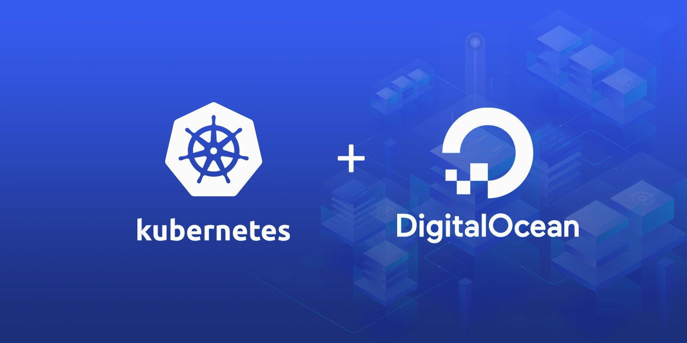

# $65 Kubernetes Cluster on DigitalOcean

This is a multipart tutorial and walkthrough on setting up a **$65** kubernetes cluster on DigitalOcean using CoreOS. It's mostly a manual setup until DigitalOcean releases thier managed kubernetes service [here](https://www.digitalocean.com/products/kubernetes/).

[Table of Contents]
  * [(Part I) Install & Setup Kubernetes Cluster](./Part-I.md)
  * [(Part II) Add Persistent Storage Support](./Part-II.md)
